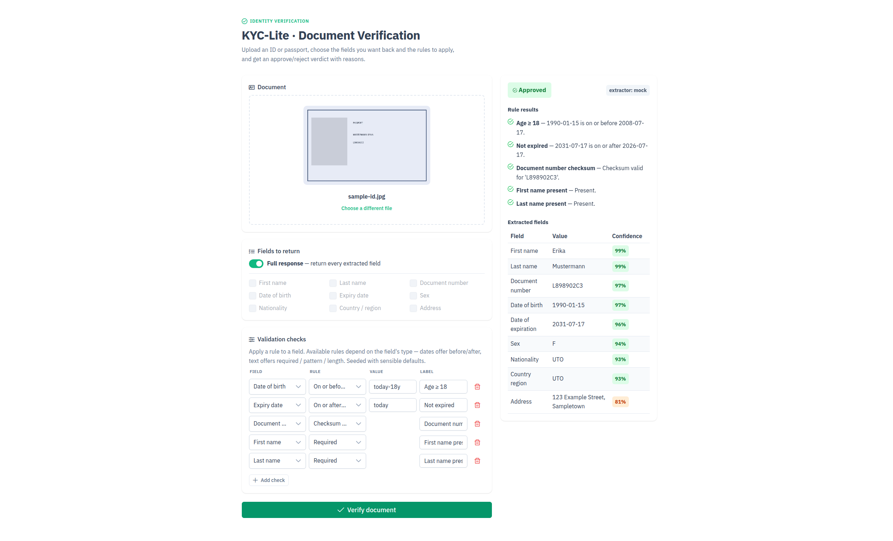

# KYC-Lite · Document Verification

[](https://github.com/HMalyhon/KycLite/actions/workflows/ci.yml)
[](LICENSE)

**[Live demo →](https://kyclite.azurewebsites.net)** (the page states which extraction engine it
is running; the first request may take ~30 s while the free-tier instance wakes up)

A small full-stack demo that verifies an ID card or passport. A user uploads a document image,
**chooses which fields to get back and which validation rules to apply**, and receives an
**approve / reject** verdict with a reason for every rule.



The cloud OCR provider (Azure AI Document Intelligence) is **fully hidden behind a backend
interface** — the web app talks only to this API and never knows a provider exists. When no
Azure credentials are configured, the backend transparently falls back to an offline mock, so
the whole thing runs locally with zero cloud setup.

```
Browser (Vue 3) ──HTTP──► ASP.NET Core API ──► IDocumentExtractor ──► Azure Doc Intelligence
                                              └► MockDocumentExtractor (no key) ─┘
                                          └► FieldCheckRunner (user-composed field checks)
```

## Why it's built this way

- **Provider hidden behind a port.** `IDocumentExtractor` is the only seam. Swapping Azure for
  the mock — or any future provider — needs no change to the API contract or the frontend.
  The active provider is chosen at startup and reported in each response (`extractorMode`).
- **Thin controllers, focused service.** Controllers handle HTTP concerns (binding, upload
  validation); `VerificationService` owns the orchestration (extract → run the user's field checks →
  project fields). The Azure SDK call lives in exactly one place.
- **One generic, type-aware validation mechanism.** Each request composes its own set of checks:
  the user attaches **field-rules** (Required / Matches pattern / Min length / Checksum / On-or-after /
  On-or-before) to any field of a matching type, and every result folds into a single approve/reject
  verdict. A check that can't be evaluated (unknown field/rule, or a type mismatch) is reported as
  *ignored* rather than silently dropped.
- **Config via `.env`.** Credentials come from a `.env` file (or environment variables), never
  committed. With no `.env`, the API runs on the offline mock.
- **Stateless & data-minimizing.** Nothing is persisted. The response returns only the fields the
  user asked for (validation still runs against the full extraction), which keeps PII exposure low.
- **Defensive by default.** Uploads are checked by magic-byte signature (not just the spoofable
  `Content-Type`); the verify endpoint is rate-limited per client IP; regex checks are ReDoS-guarded;
  and all faults return RFC 7807 `ProblemDetails` with no stack traces.

## Project layout

```
backend/Directory.Build.props  solution-wide quality gate (warnings-as-errors, analyzers, StyleCop)
backend/.editorconfig          house style + the curated analyzer/StyleCop ruleset (each opt-out has a reason)
backend/KycLite.slnx           ties the API and test projects together
backend/KycLite.Api/           ASP.NET Core (.NET 10) Web API (controllers)
  Controllers/            CatalogController (catalogs), VerificationController (verify)
  Services/               IVerificationService — orchestrates extract → validate → project
  Extraction/             IDocumentExtractor + Azure & Mock implementations, options, exceptions
  Validation/             IFieldRule + FieldCheckRunner, FileSignatures, ICAO 9303 checksum (Mrz731)
    FieldRules/           the six field-rules + DateParsing
  Infrastructure/         GlobalExceptionHandler (RFC 7807 ProblemDetails)
  Catalog/                discoverable field, field-rule & default-check definitions
  Models/                 API + extraction DTOs, verify form model
  .env.example            copy to .env to supply Azure credentials
backend/KycLite.Api.Tests/ xUnit: field-rule, runner, checksum, service + API integration tests
frontend/                 Vue 3 + Vite + TypeScript + PrimeVue (Aura theme) — see frontend/README.md
  src/api/client.ts       typed API client (the only thing that talks to the backend)
  src/components/         UploadCard, FieldSelector, FieldRuleBuilder, ResultPanel
  src/composables/        useVerification — all screen state & orchestration
  src/lib/                dateParam — relative date-param hints (+ its unit tests)
  eslint.config.ts        ESLint flat config (eslint-plugin-vue lints inside SFC templates)
  .prettierrc.json        formatting; ESLint defers to it (no rule fights)
  .env.example            copy to .env to override the dev proxy target
.github/workflows/ci.yml  quality gates on every push/PR + OIDC deploy of main to Azure
infra/                    main.bicep (App Service) + README.md (one-time Azure/OIDC setup)
```

## Running locally

### 1. Backend (mock mode — no Azure account needed)

```bash
cd backend/KycLite.Api
dotnet run
```

It listens on `http://localhost:5000` and logs `Document extractor active: mock`.

Quick check:

```bash
curl http://localhost:5000/api/fields          # fields the user can request
curl http://localhost:5000/api/field-rules     # field-rules the user can apply
curl http://localhost:5000/api/default-checks  # the seed check set the UI starts with
curl -F file=@some-id.jpg -F "fields=*" \
     -F 'fieldChecks=[{"field":"dateOfBirth","rule":"dateOnOrBefore","param":"today-18y"},{"field":"documentNumber","rule":"checksum","param":null}]' \
     http://localhost:5000/api/verify
```

### 2. Frontend

```bash
cd frontend
npm install
npm run dev      # http://localhost:5173, proxies /api -> :5000
```

Open the app, upload an image, toggle **Full response** vs specific fields, pick rules, and
click **Verify document**. See [`frontend/README.md`](frontend/README.md) for the frontend
toolchain (scripts, config, and how the discovery-driven UI is wired).

## Tests

```bash
cd backend && dotnet test    # xUnit: 67 unit + integration tests
cd frontend && npm run test  # Vitest: 32 unit tests
```

The backend suite (`backend/KycLite.Api.Tests/`) covers:

- **Field-rules** — Required / Pattern (incl. invalid-regex + ReDoS timeout) / MinLength / Checksum,
  and the date rules with relative params (age-18 and expiry boundaries, out-of-range offsets).
- **`FieldCheckRunner`** — result labelling, and that unknown-field / unknown-rule / type-mismatched
  checks are recorded as *ignored* (not silently dropped) rather than counted toward the verdict.
- **`Mrz731`** — the 7-3-1 check-digit algorithm (known values, malformed input, separators).
- **`VerificationService`** — verdict logic (incl. field checks folded in) against an injected
  `TimeProvider`, and that field projection narrows the response while rules still evaluate against
  the full extraction.
- **API integration** (`WebApplicationFactory`) — `/api/fields`, `/api/field-rules`,
  `/api/default-checks`, and `/api/verify` over an in-memory server, including a spoofed-content
  upload, surfaced ignored checks, and 400s for a missing file, unsupported content type, and
  malformed `fieldChecks` JSON.

Tests follow the **Arrange-Act-Assert** convention.

The frontend suite (Vitest) covers `dateParam` — parsing and validating the relative date params
(`today`, `today-18y`) that the date rules accept, including malformed and out-of-range offsets.

## Quality gate

Both halves fail the build on any warning, so neither can rot quietly. **CI**
([`.github/workflows/ci.yml`](.github/workflows/ci.yml)) runs these same gates on every push and
pull request — the badge at the top reflects the latest run.

```bash
cd backend  && dotnet build     # warnings-as-errors
cd frontend && npm run lint     # --max-warnings 0
cd frontend && npm run format:check
```

- **Backend** (`Directory.Build.props` + `.editorconfig`): `TreatWarningsAsErrors`,
  `AnalysisLevel=latest-recommended` (CA rules), `EnforceCodeStyleInBuild` (IDE rules), and
  **StyleCop** (SA rules). StyleCop's defaults encode a pre-modern C# style, so the ruleset is
  curated rather than adopted wholesale — every opt-out in `.editorconfig` carries the reason it
  was made (e.g. `SA1101`'s `this.` prefix conflicts with primary constructors).
- **Frontend** (`eslint.config.ts` + `.prettierrc.json`): **ESLint** with `eslint-plugin-vue`,
  which lints *inside* SFC templates — catching things a type-checker can't see (unhyphenated
  attributes, attribute order, missing `v-for` keys). **Prettier** owns formatting; ESLint's
  stylistic rules are disabled so the two never fight.

## Enabling real Azure (optional)

Copy the example env file and fill in your credentials — **no code or frontend change**:

```bash
cd backend/KycLite.Api
cp .env.example .env
# edit .env:
#   DocumentIntelligence__Endpoint=https://<resource>.cognitiveservices.azure.com/
#   DocumentIntelligence__ApiKey=<key>
dotnet run
```

`.env` is git-ignored. On restart the log flips to `Document extractor active: azure` and the
prebuilt `idDocument` model is used. That the frontend is unaffected is the point of the
abstraction. (Environment variables and .NET user-secrets work too — they override `.env`.)

## Deployment

Every push to `main` that passes the quality gates is deployed to **Azure App Service** by the
`deploy` job in [`.github/workflows/ci.yml`](.github/workflows/ci.yml).

- **Single app, single origin.** The pipeline publishes the ASP.NET Core API, drops the built Vue
  app into its `wwwroot`, and ships one package. The API serves the SPA (and its relative `/api`
  calls) from the same origin — one free-tier (F1) resource, one URL, no CORS to configure.
  `Program.cs` only wires up static-file + SPA-fallback serving when a `wwwroot/index.html` is
  present, so local development (Vite dev server + proxy) is untouched.
- **OIDC, no stored secret.** GitHub Actions authenticates to Azure with a **federated identity**
  (`azure/login` via `id-token`), so there's no publish profile or client secret in the repo — the
  three `AZURE_*` values are non-sensitive identifiers.
- **Infra as code.** [`infra/main.bicep`](infra/main.bicep) provisions the plan and web app;
  [`infra/README.md`](infra/README.md) is the one-time setup (resource, Entra federation, secrets),
  after which deploys are automatic. The deployed demo runs in **mock** mode unless
  `DocumentIntelligence__*` app settings are supplied.

## API

| Method | Path                  | Purpose                                                                 |
| ------ | --------------------- | ----------------------------------------------------------------------- |
| GET    | `/api/status`         | Which extractor this instance runs (`azure`/`mock`); read on page load. |
| GET    | `/api/fields`         | Fields the user can request, each tagged with a type (drives the UI).   |
| GET    | `/api/field-rules`    | Field-rules the user can attach to a field (key, label, param, types).  |
| GET    | `/api/default-checks` | The seed check set the UI starts with.                                  |
| POST   | `/api/verify`         | multipart `file`, `fields` (csv or `*`), `fieldChecks` (JSON array).    |
| GET    | `/health`             | Liveness probe.                                                         |

`/api/verify` returns
`{ status, documentType, extractedFields, ruleResults[], ignoredChecks[], extractorMode }`.
`fieldChecks` is a JSON array, e.g. `[{"field":"documentNumber","rule":"pattern","param":"^[A-Z0-9]+$"}]`.
Beyond `200`, it can return `400` (bad upload / malformed `fieldChecks`), `422` (the provider couldn't
read the document), `429` (rate limit), and `504` (provider timeout) — all as RFC 7807 `ProblemDetails`.

## Validation — field-rules

There is one generic, type-aware validation mechanism: the user attaches a **field-rule** to a field
of a matching type, and every result folds into the single approve/reject verdict.

| Key             | Applies to | Checks                                                          | Param                       |
| --------------- | ---------- | -------------------------------------------------------------- | --------------------------- |
| `required`      | text, date | The field is present and non-empty.                            | —                           |
| `pattern`       | text       | The field matches a regex (ReDoS-guarded timeout).             | regex                       |
| `minLength`     | text       | The field is at least N characters.                            | minimum length              |
| `checksum`      | text       | The value ends in a valid ICAO 9303 (7-3-1) check digit.       | —                           |
| `dateOnOrAfter` | date       | The date is ≥ the reference (e.g. "not expired").              | date or `today±offset`      |
| `dateOnOrBefore`| date       | The date is ≤ the reference (e.g. age ≥ 18 via `today-18y`).   | date or `today±offset`      |

The default check set (`/api/default-checks`) reproduces the classic age-≥-18, not-expired,
document-number-checksum, and name-present rules using these field-rules. A check the runner can't
evaluate (unknown field/rule, or a rule that doesn't apply to the field's type) is returned under
`ignoredChecks` with a reason, so it can't quietly count as a pass.

Add a rule by implementing `IFieldRule` and registering it in `Program.cs`; it appears automatically
in `/api/field-rules` and the field-check builder.
